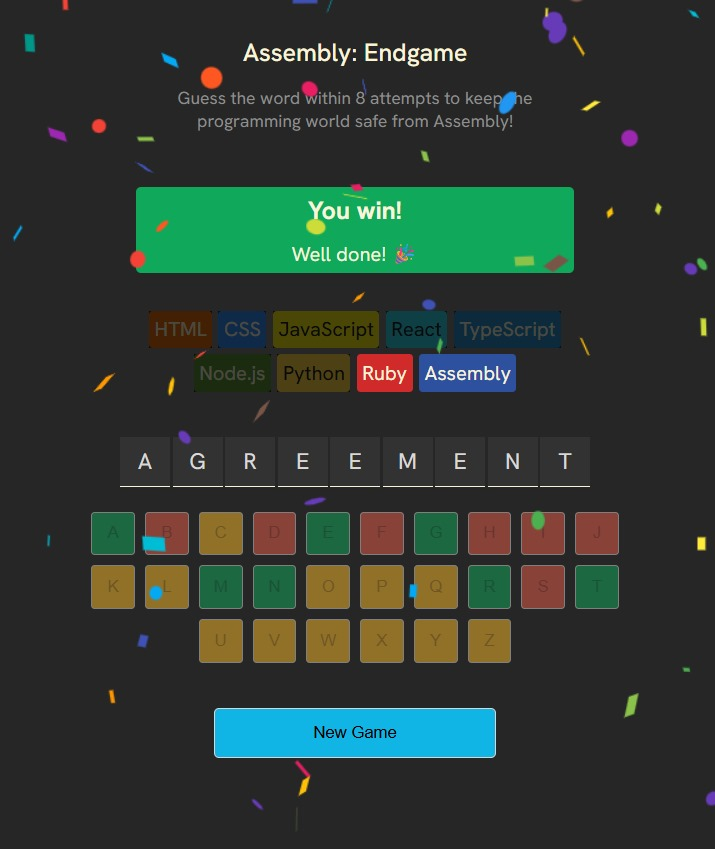
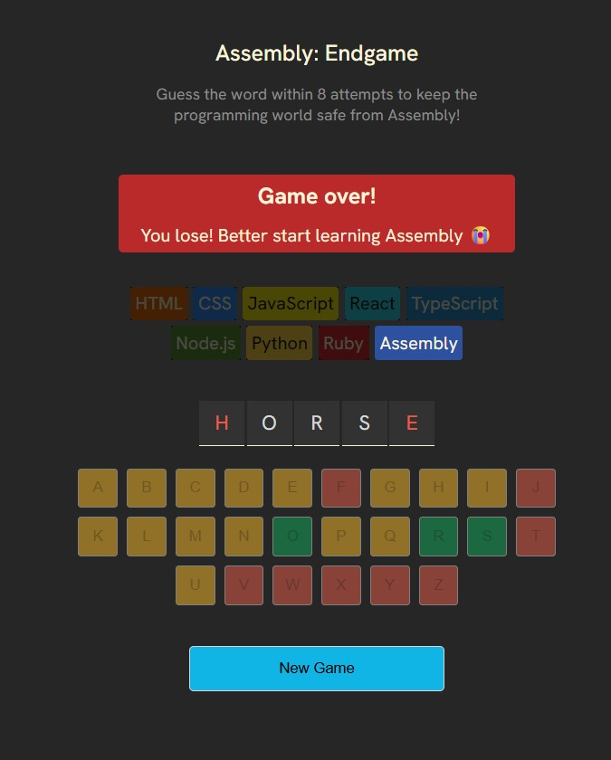

#  Code Crypt: Assembly Endgame

A web-based word guessing game where you must protect the programming world from being overrun by Assembly! Inspired by Hangman, but with a developer twist. Built using **React**, this is the final project of Scrimba’s Frontend Developer Career Path.




---

##  Gameplay

You're given a mystery programming-related word.  
Each wrong guess eliminates a programming language.  
If all languages fall, you're left with nothing but... Assembly 😱

-  8 guesses max  
-  Visual chips for each language  
-  Confetti celebration on win 🎉  
-  Farewell messages on each wrong guess  
-  Final word reveal if you lose  
-  Fully accessible for screen readers  

---

##  Technologies Used

- **React**
- **React Confetti** (for win animations)
- **clsx** (for conditional classNames)
- **Custom state logic** for game status, keyboard interaction, and accessibility

---

##  Features & Components

| Feature             | Description                                                 |
|---------------------|-------------------------------------------------------------|
|  Random Word      | Pulled from a predefined list with `getRandomWord()`        |
|  Custom Keyboard  | On-screen clickable alphabet buttons                        |
|  Farewell Logic   | Displays themed goodbye messages per eliminated language    |
|  Game Logic        | Tracks guessed letters, win/loss conditions                 |
|  Accessibility     | Includes ARIA roles and live regions for screen readers     |
|  Confetti          | Celebratory animation on successful guess                   |
|  New Game Button  | Resets state and starts a new game                          |

---

##  Getting Started

### 1. Clone the repo

```bash
git clone https://github.com/Shubhan9/Code-Crypt.git
cd Code-Crypt
```

### 2. Install dependencies

```bash
npm install
```

### 3. Run the project locally

```bash
npm run dev
```

---

##  Project Structure

```
.
├── public/
├── src/
│   ├── App.jsx
│   ├── languages.js
│   ├── utils.js
│   └── styles.css
├── package.json
└── README.md
```

---

##  What I Learned

This project helped reinforce key React concepts:

- Managing derived state (win/loss logic, incorrect guesses)
- Component-based architecture
- Conditional rendering and accessibility (ARIA roles, screen reader support)
- Using utility libraries like `clsx` for clean class handling
- Incorporating third-party packages (e.g., react-confetti)

---

##  Live Demo

 **Coming soon**  

---

##  License

MIT License — feel free to fork, remix, and learn!

---

##  Acknowledgments

- Scrimba’s Frontend Career Path  
- Inspired by Hangman, with a dev-themed twist

---

> *"Guess wisely, or suffer the fate of Assembly!"* 
